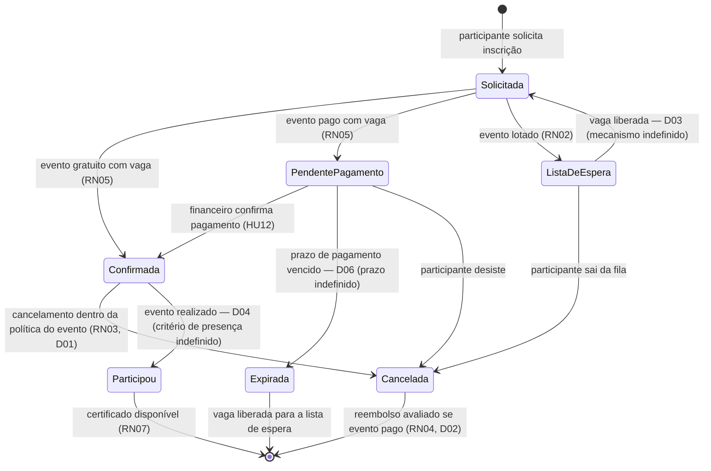

# Ciclo de Vida da Inscrição

Enquanto escrevia as histórias, percebi que quase todas as regras de negócio do Eventus são, no fundo, restrições sobre **quando uma inscrição pode mudar de estado**: pode cancelar? depende do estado e do prazo. Pode emitir certificado? depende do estado e do evento ter ocorrido. Libera vaga? depende de qual estado a inscrição estava.

Por isso, em vez de escrever casos de uso textuais (que descreveriam esses mesmos comportamentos espalhados em fluxos alternativos), preferi concentrar tudo em uma máquina de estados. É um artefato só, cabe numa tela, e cada transição aponta a regra ou a dúvida que a governa.

## Notas sobre as transições

A liberação de vaga acontece em três transições: `Confirmada → Cancelada`, `PendentePagamento → Expirada` e saída da lista de espera. Em todas elas, a vaga liberada deve acionar o mecanismo da lista de espera — cujo funcionamento ainda depende de D03. Esse é o motivo de D03 e D06 serem, na minha leitura, as duas dúvidas mais urgentes do projeto: elas afetam o miolo do diagrama.

O estado `PendentePagamento` só reserva vaga se a resposta de D06 for "reserva ao iniciar o pagamento". Se a resposta for "só após confirmação", o diagrama muda: a transição `Solicitada → PendentePagamento` não decrementa vagas, e passa a existir uma disputa na confirmação. Deixei o diagrama na versão que considero mais provável, mas marquei a dependência.

Não existe transição de `Cancelada` ou `Expirada` de volta para `Confirmada`. Se o participante mudar de ideia, faz nova inscrição (sujeita a vaga e lista de espera). Foi uma decisão minha para simplificar — vale confirmar com os organizadores.
